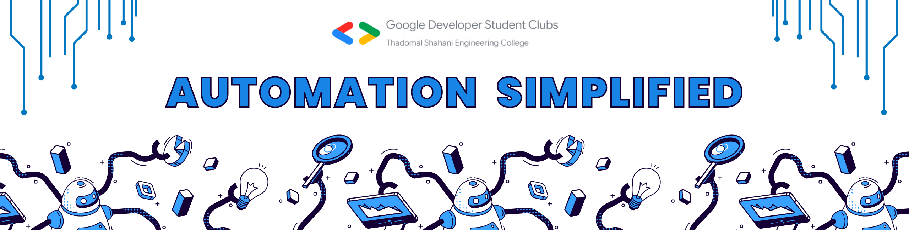

# Automation Simplified

Experience the simplicity and power of automation by learning about bots and extensions.
A four day campaign conducted by Google Developer Student Clubs of Thadomal Shahani Engineering College, Mumbai (GDSC-TSEC)

 

## Bots Session

The Following repo consists the code for the first session- Understanding Bots and Creating your First Selenium Bot hosted by [Girish Rajani](https://github.com/girishrajani).

 

## Important Links

[YouTube Link for the Session- Understanding Bots and Creating your First Selenium Bot](
https://www.youtube.com/watch?v=lKPXX6ENPmk)

[Link for Google Slides](https://docs.google.com/presentation/d/1bezS7FYR5uhgMWfbEKs37yCjEFCd83ctAioOHtP5Z6E/edit?usp=sharing)

[YouTube Link for 2nd Session- Introduction to Extensions and Build your First Extension](https://www.youtube.com/watch?v=lrhvkx4VTHE)

[GDSC-TSEC Chapter Link](https://gdsc.community.dev/thadomal-shahani-engineering-college-mumbai/)

[GDSC-TSEC Instagram](https://www.instagram.com/gdsctsec/)
